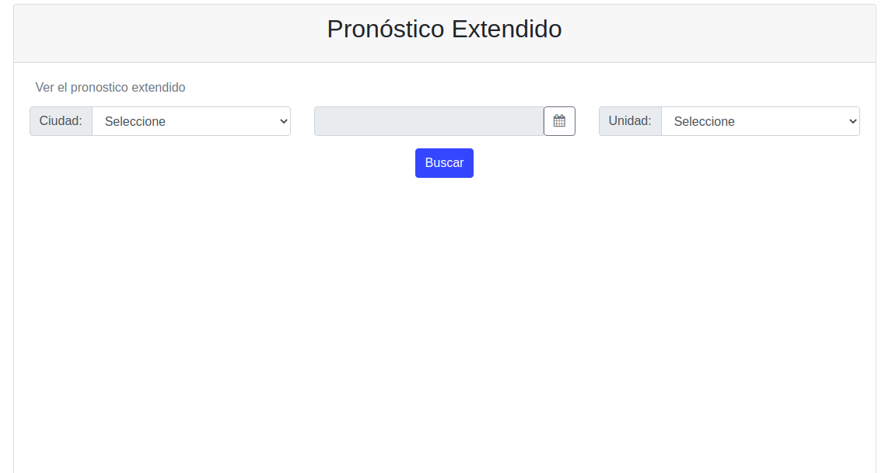
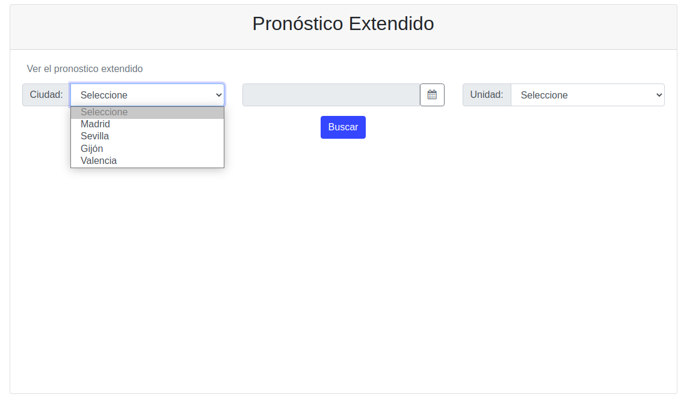
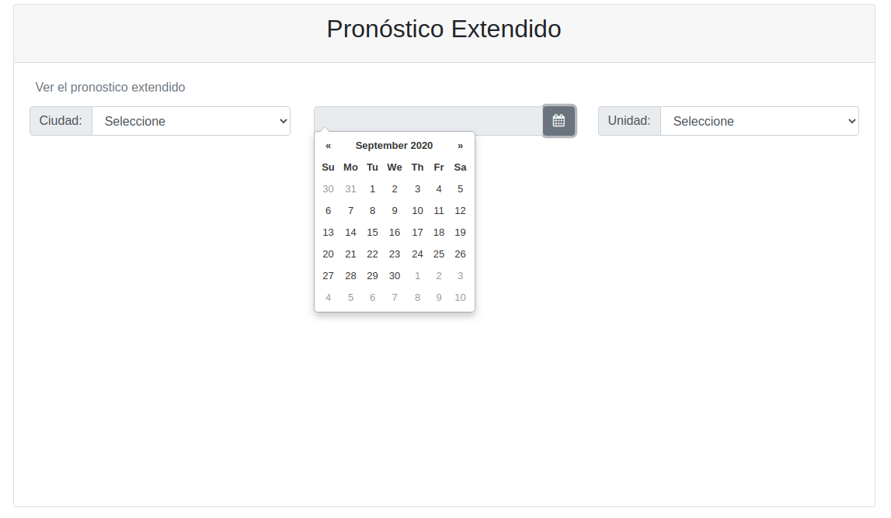
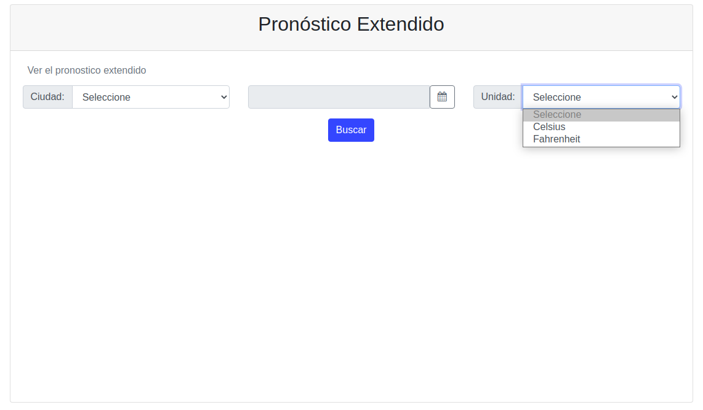
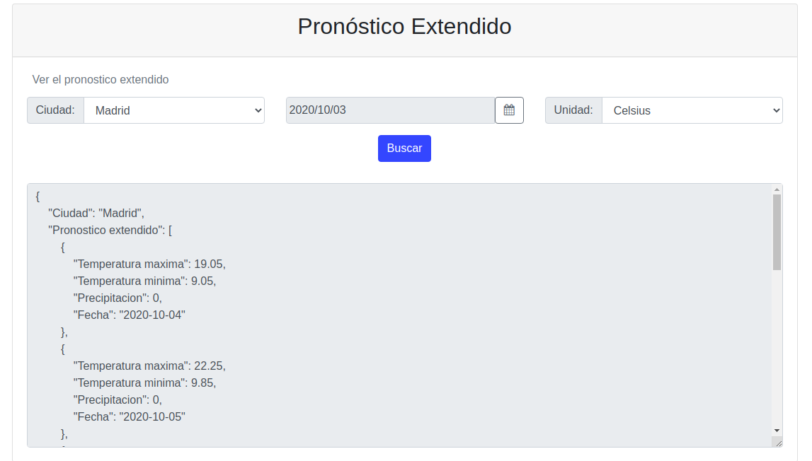
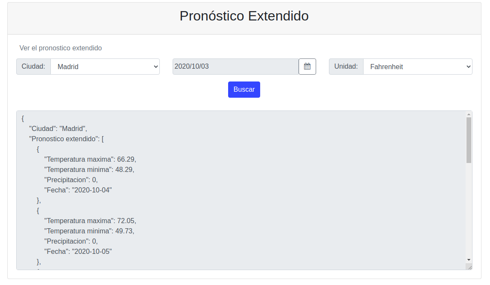
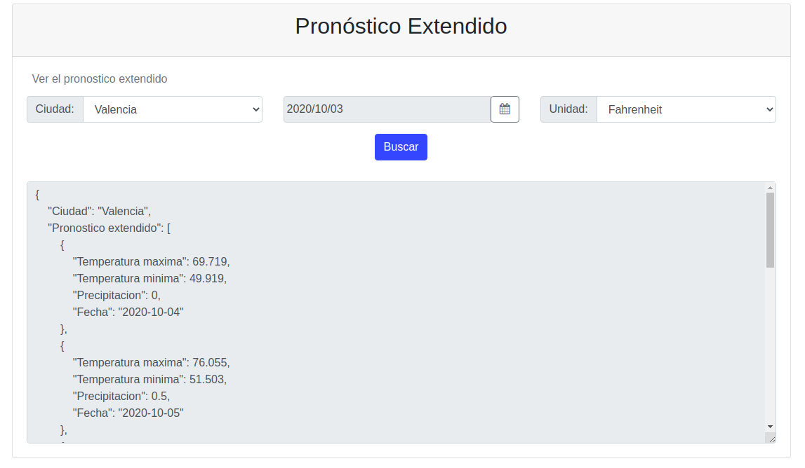

## Meteológica. Prueba de selección para puesto de programador backend

### Librerías utilizadas
Para el desarrollo de la api se utilizaron las librerias **GNU Libmicrohttpd** que permite ejecutar de manera sencilla un servidor HTTP para una aplicación en C, y **json-c** para convertir el resultado en un JSON.
La elección en ambos casos, se debe a la facilidad de uso, la buena documentación y el hecho de que sean Open Source.

Para evitar restricciones al acceso de recursos desde un origen distinto (dominio) del de la api, se ejecuta un servidor web local. Por su facilidad, se usa el módulo **SimpleHTTPServer** de **Python**. De esta manera se puede ejecutar el HTML desde un dominio y puerto específico, autenticado en la api.

Autenticación de origen en el servidor:

```
/* to allow CORS from origin. Character "*" allows all origins (not recommended) */
MHD_add_response_header(response, "Access-Control-Allow-Origin", client);
```

### Uso de la solución

#### Con Docker

##### Servidor
```bash
sudo docker build -t api .
sudo docker run -it -p 8888:8888 api ./api 8888
```

##### Cliente
```bash
cd client && sudo docker build . -t python-client
sudo docker run -d -p 9000:9000 python-client
```

#### Ejecución desde consola

1) Instalación de librerías:

```bash
sudo apt-get update -y
sudo apt-get install -y libmicrohttpd-dev
sudo apt install -y libjson-c-dev
```

2) Servidor

a) Compilar servidor

```bash
gcc -o api api.c -ljson-c  -lmicrohttpd
```

b) Ejecutar servidor

```bash
./api 8888
```

3) Cliente

a) Con **Python 2**
```bash
python -m SimpleHTTPServer 9000
```

b) Con **Python 3**
```bash
python3 -m http.server 9000
```

#### Interfaz gráfica

Desde un navegador web se debe acceder a http://localhost:9000/

### Explicación de uso

El frontend realiza peticiones GET y el backend devuelve como resultado un JSON.
Como podemos ver, los datos de entrada son Ciudad, Fecha y Unidad. Es necesario que estén los tres campos completos para poder realizar la búsqueda.


La Ciudad se selecciona desde un combo, en las que aparecen las posibles ciudades a elegir. Para esto se realiza al inicio una consulta a la Api en la que se obtiene como resultado las ciudades que se encuentran cargadas en el archivo cvs desde donde se toman los datos.


La Fecha se selecciona desde un calendario en el formato año, mes, día (YYYY/MM/DD).


Para la Unidad se puede seleccionar uno de dos opciones, Celsius o Fahrenheit.


Como resultado de la búsqueda vamos a obtener la Temperatura (máxima y mínima) y la Precipitación, para la ciudad seleccionada, para los datos que tengan una fecha posterior a la indicada (sin incluir la fecha introducida), convertidos a la unidad elegida. El mismo se va a obtener en formato JSON.

A continuación podemos ver un ejemplo de la estructura del objeto JSON:

```json
{
	"Ciudad": "Madrid",
	"Pronostico extendido": [
	{
		"Temperatura maxima": 22.45,
		"Temperatura minima": 12.55,
		"Precipitacion": 0,
		"Fecha": "2020-10-09"
	},
	{
		"Temperatura maxima": 20.95,
		"Temperatura minima": 13.25,
		"Precipitacion": 0,
		"Fecha": "2020-10-10"
	}
	]
}
```

### Ejemplo de uso

1. Realizamos una búsqueda para una ciudad, fecha y unidad.


2. Cambiamos la unidad a Fahrenheit y obtenemos el siguiente resultado.


3. Ahora consultamos por otra ciudad.


4. Por último buscamos a partir de una nueva fecha.


